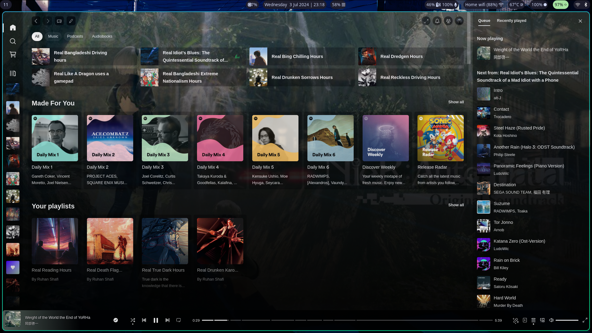

## Ruhan Shafi's 2024 Hyprland Configurations

## Screenshoots

The Pretty Looking Good Stuff :)

Spiced up Spotify - Spicetify (Work in Progress)

## Applications

* OS - Arch BTW :)
* WM - Hyprland
    * Wallpaper Daemon - ``wpaperd``
    * Icons - Inverse Blue
    * Screen Locking - ``hyprlock``
    * Screen Idleing - ``hypridle``
    * Multiple Screen Workflow - ``hyprsome``
    * Multiple Screen Auto Setup - ``nwg-display``
* Web Browser - Floorp
    * Theme - Customised Shina Fox Rice
    * Sidebars
        * Tabs | Left side - Sidebery
        * Powerbar | Right Side - Native Floorp Powerbar Panel (Will not be present if using Firefox)
* Status Bar - Waybar
* Dmenu Launcher - Rofi
* Music Player - Spicetify
    * Theme - Galaxy (Suprisingly not Catppuccin)

* Terminal - Alacritty
    * Shell - Zsh
        * Theme - Powerlevel10k
* File Manager - Dolphin
* IDEs 
    * General Editing - Neovim
    * Machine Learning & Juipter Notebook / Stuff you really don't want to do in a terminal - Code
    * Maths - TexStudio + TexLive
* Obsidian

## Keybindings
| Keys | Action |
| :--- | :--- |
| <kbd>Super</kbd> + <kbd>T</kbd> | Launch terminal emulator (Alacritty) |
| <kbd>Super</kbd> + <kbd>E</kbd> | Launch file manager (Dolphin) |
| <kbd>Super</kbd> + <kbd>L</kbd> | Lock Screen (Hyprlock) |
| <kbd>Super</kbd> + <kbd>P</kbd> | Launch Display Manager (nwg-display) |
| <kbd>Super</kbd> + <kbd>Alt</kbd> + <kbd>→</kbd> | Next Wallpaper |
| <kbd>Super</kbd> + <kbd>Alt</kbd> + <kbd>←</kbd> | Previous Wallpaper |
                        
## Stargazers over time ( Yeah I have a Big Ego... So what?)

                    
