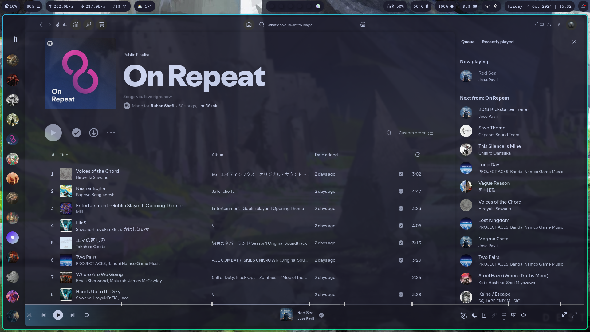

# Ruhan Shafi's 2024 Hyprland Configurations

## Screenshoots

The Pretty Looking Good Stuff :)

Shina Fox Floorp Rice with Catppuccin Colours

Spiced up Spotify - Spicetify (Work in Progress)

## Nvidia Guide (Credit Goes to Gl00ria):

Packages Required

| Package Name                                                                            | Description                                        | Package Manager |
| :--------------------------------------------------------------------------------------:| :-------------------------------------------------:| :-------------: |
| [nvidia](https://archlinux.org/packages/extra/x86_64/nvidia/)                           | driver                                             | Pacman          |
| [ nvidia-utils ](https://archlinux.org/packages/extra/x86_64/nvidia-utils/)             | drivers Utils                                      | Pacman          |
| [ nvidia-prime ](https://archlinux.org/packages/extra/any/nvidia-prime/)                | nvidia offload                                     | Pacman          |
| [libva-nvidia-driver](https://archlinux.org/packages/extra/x86_64/libva-nvidia-driver/) | VA-API implementation that uses NVDEC as a backend | Pacman          |

   

Configurations to enable Nvidia Support

    1. Add `nvidia_drm.modeset=1` to `GRUB_CMDLINE_LINUX_DEFAULT=` in `/etc/default/grub`
    2. Run `sudo grub-mkconfig -o /boot/grub/grub.cfg`
    3.  Add `nvidia nvidia_modeset nvidia_uvm nvidia_drm` to `/etc/mkinitcpio.conf` then
   Generate new image: `sudo mkinitcpio --config /etc/mkinitcpio.conf --generate /boot/initramfs-custom.img`
    4. Add/create the following: `options nvidia-drm modeset=1` in `/etc/modprobe.d/nvidia.conf`
     

## Applications

### Network:

Packages

| Package Name                                                                                    | Description          | Package Manager |
| :---------------------------------------------------------------------------------------------: | :------------------: | :-------------: |
| [ networkmanager ](https://archlinux.org/packages/extra/x86_64/networkmanager/)                 | network manager      | Pacman          |
| [ network-manager-applet ](https://archlinux.org/packages/extra/x86_64/network-manager-applet/) | network manager tray | Pacman          |

   

### Bluetooth:

Packages

| Package Name                                                              | Description                    | Package Manager |
| :-----------------------------------------------------------------------: | :----------------------------: | :-------------: |
| [ bluez ](https://archlinux.org/packages/extra/x86_64/bluez/)             | Daemons for bluetooth protocol | Pacman          |
| [ bluez-utils ](https://archlinux.org/packages/extra/x86_64/bluez-utils/) | utils for bluetooth            | Pacman          |
| [ blueman ](https://archlinux.org/packages/extra/x86_64/blueman/)         | bluetooth tray                 | Pacman          |

   

### Audio Drivers:
 

Packages

| Package Name                                                              | Description                    | Package Manager |
| :-----------------------------------------------------------------------: | :-----------------------------:| :-------------: |
| Pipewire                                                                  | Audio Drivers                  | Pacman          |
| Wireplumber                                                               | Pipewire Plugin                | Pacman          |

 
</detials>

* OS - Arch BTW :)
* WM - Hyprland
    * Wallpaper Daemon - ``wpaperd``
    * Icons - Inverse Blue
    * Screen Locking - ``hyprlock``
    * Screen Idleing - ``hypridle``
    * Multiple Screen Workflow - ``hyprsome``
    * Multiple Screen Auto Setup - ``nwg-display``
* Web Browser - Floorp
    * Theme - Customised Shina Fox Rice
    * Sidebars
        * Tabs | Left side - Sidebery
        * Powerbar | Right Side - Native Floorp Powerbar Panel (Will not be present if using Firefox)
* Status Bar - Waybar
* Dmenu Launcher - Rofi
* Music Player - Spicetify
    * Theme - Galaxy (Suprisingly not Catppuccin)

* Terminal - Alacritty
    * Shell - Zsh
        * Theme - Powerlevel10k
* File Manager - Dolphin
* IDEs 
    * General Editing - Neovim
    * Machine Learning & Juipter Notebook / Stuff you really don't want to do in a terminal - Code
    * Maths - TexStudio + TexLive
* Obsidian

## Keybindings
| Keys                                             | Action                               |
| :----------------------------------------------: | :----------------------------------: |
| <kbd>Super</kbd> + <kbd>T</kbd>                  | Launch terminal emulator (Alacritty) |
| <kbd>Super</kbd> + <kbd>E</kbd>                  | Launch file manager (Dolphin)        |
| <kbd>Super</kbd> + <kbd>L</kbd>                  | Lock Screen (Hyprlock)               |
| <kbd>Super</kbd> + <kbd>P</kbd>                  | Launch Display Manager (nwg-display) |
| <kbd>Super</kbd> + <kbd>Alt</kbd> + <kbd>→</kbd> | Next Wallpaper                       |
| <kbd>Super</kbd> + <kbd>Alt</kbd> + <kbd>←</kbd> | Previous Wallpaper                   |
                        
## Stargazers over time ( Yeah I have a Big Ego... So what?)

                    
